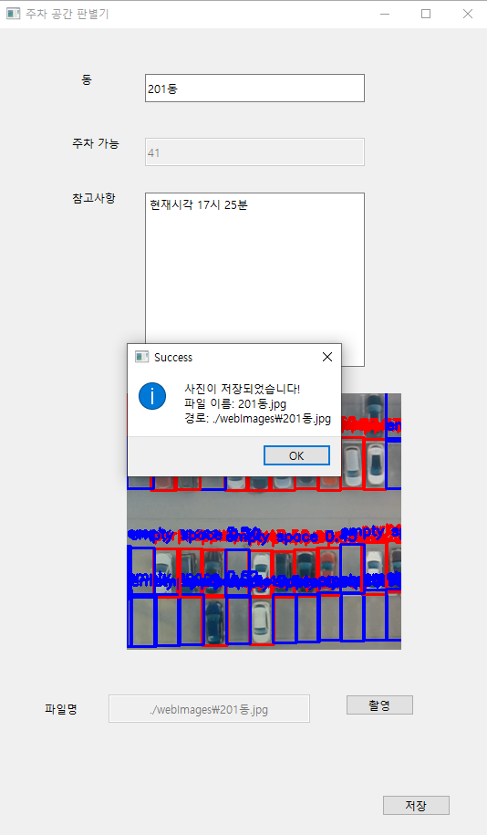
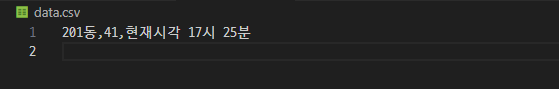

# pyQT_yolo
## 1. yolo 모델을 이용한 프로그램 만들기
### 전에 QT_designer를 이용해 만들어둔 주소록 프로그램에 주차 공간 파악 기능을 추가
https://github.com/Cov4w/QT_Designer
## 2. yolo 모델을 학습시키기 위한 데이터 구하기
### roboflow에서 pklot yolov8 다운로드

### 2.1 roboflow에서 다운 받은 파일 구조

## 3. data.yaml 파일에서 학습시킬 데이터 경로 지정

## 4. yolo 모델을 학습 시킬 때 그래픽카드를 사용하기 위해 사용 여부 파악

### 4.1 사용 가능 여부를 파악했다면 학습시키기 위한 코드에 그래픽카드 지정
#### device = 0 을 추가하여 그래픽카드를 지정합니다.

## 5. train.py를 실행시켜 모델 학습 시작
#### 그래픽카드 지정이 잘 되어 GPU_mem 수치가 뜨는 것을 확인 할 수 있습니다.

## 6. 학습을 완료했다면 기존 주소록 코드에 추가합니다.
### 먼저 yolov8을 사용하기 위해 YOLOv8 라이브러리를 임포트합니다.
<pre>
  <code>
    from ultralytics import YOLO
  </code>
</pre>
### YOLOv8 모델 경로를 지정하여 모델을 로드합니다.
<pre>
  <code>
    self.model = YOLO("./my_yolo_project/custom_model/weights/best.pt")
  </code>
</pre>
### YOLOv8 모델과 카메라의 찍힌 주차장을 분석한 결과물을 표시하기 위한 코드를 추가합니다.
### 추가로 주차장 빈공간의 대한 데이터를 수집하기 위해 empty space 변수도 추가합니다.
<pre>
  <code>
    def update_frame(self):
        ret, frame = self.cap.read()
        if not ret:
            return

        results = self.model(frame)

        # 'empty space' 개체 수 계산
        empty_space_count = 0

        # 클래스 매핑 정의
        label_map = {
            0: ('empty space', (255, 0, 0)),     
            1: ('parked place', (0, 0, 255))    
        }

        for result in results[0].boxes:
            x1, y1, x2, y2 = map(int, result.xyxy[0])
            cls = int(result.cls.item())  # 클래스 번호
            conf = float(result.conf.item())  # 신뢰도
            label_name, color = label_map.get(cls, ("unknown", (0, 0, 255)))

            # 'empty space' 개체 수 증가
            if label_name == 'empty space':
                empty_space_count += 1

            label = f"{label_name} {conf:.2f}"
            cv2.rectangle(frame, (x1, y1), (x2, y2), color, 2)
            cv2.putText(frame, label, (x1, y1 - 10), cv2.FONT_HERSHEY_SIMPLEX, 0.5, color, 2)

        # UI에 'empty space' 개체 수 표시
        self.ui.lineEditPhone.setText(str(empty_space_count))  # 기존 phone 필드에 표시

        frame = cv2.cvtColor(frame, cv2.COLOR_BGR2RGB)
        h, w, ch = frame.shape
        bytes_per_line = ch * w
        qimg = QImage(frame.data, w, h, bytes_per_line, QImage.Format.Format_RGB888)
        self.ui.lblCamera.setPixmap(QPixmap.fromImage(qimg))
  </code>
</pre>
### 결과물 1 : 빈 공간은 파란색 주차된 공간은 빨간색으로 표시됩니다.
#### 주차 가능 레이블에 현재 'empty space' 레이블 갯수를 표시합니다.

### 결과물 2 : 저장을 누르게 되면 해당 프로그램으로 수집한 데이터를 csv에 저장합니다.

