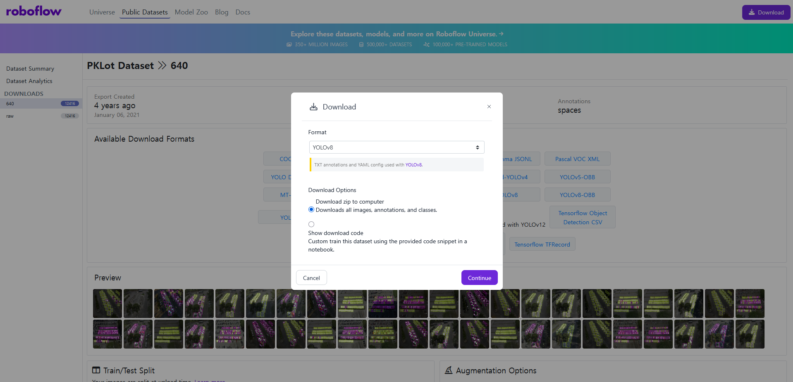
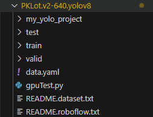
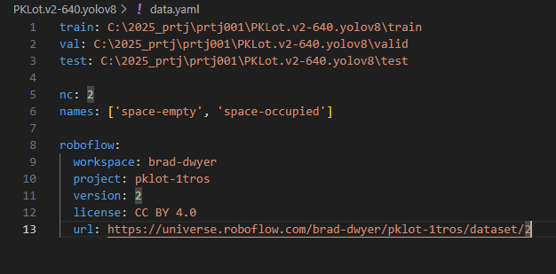
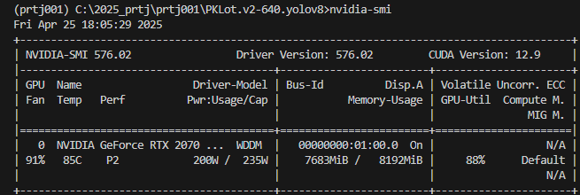
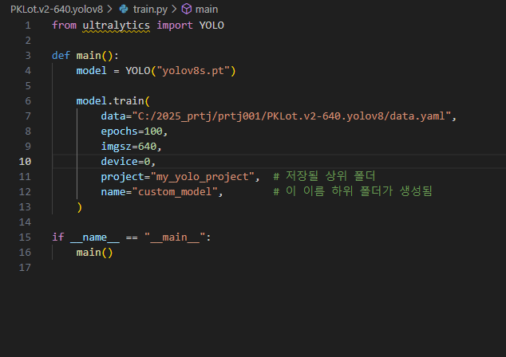
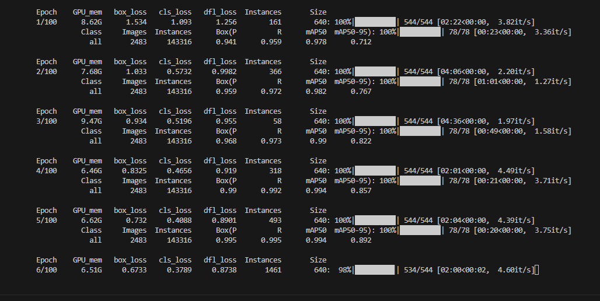
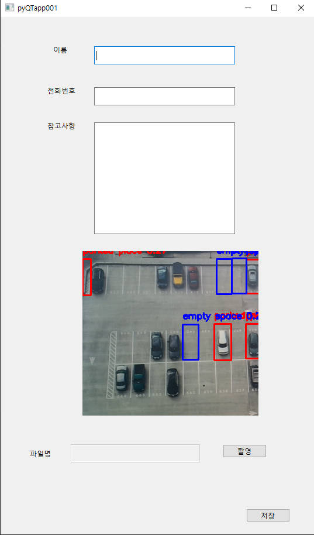

# pyQT_yolo
## 1. yolo 모델을 이용한 프로그램 만들기
### 전에 QT_designer를 이용해 만들어둔 주소록 프로그램에 주차 공간 파악 기능을 추가
https://github.com/Cov4w/QT_Designer
## 2. yolo 모델을 학습시키기 위한 데이터 구하기
### roboflow에서 pklot yolov8 다운로드

### 2.1 roboflow에서 다운 받은 파일 구조

## 3. data.yaml 파일에서 학습시킬 데이터 경로 지정

## 4. yolo 모델을 학습 시킬 때 그래픽카드를 사용하기 위해 사용 여부 파악

### 4.1 사용 가능 여부를 파악했다면 학습시키기 위한 코드에 그래픽카드 지정
#### device = 0 을 추가하여 그래픽카드를 지정합니다.

## 5. train.py를 실행시켜 모델 학습 시작
#### 그래픽카드 지정이 잘 되어 GPU_mem 수치가 뜨는 것을 확인 할 수 있습니다.

## 6. 학습을 완료했다면 기존 주소록 코드에 추가합니다.
### 결과물 빈 공간은 파란색 주차된 공간은 빨간색으로 표시됩니다.

